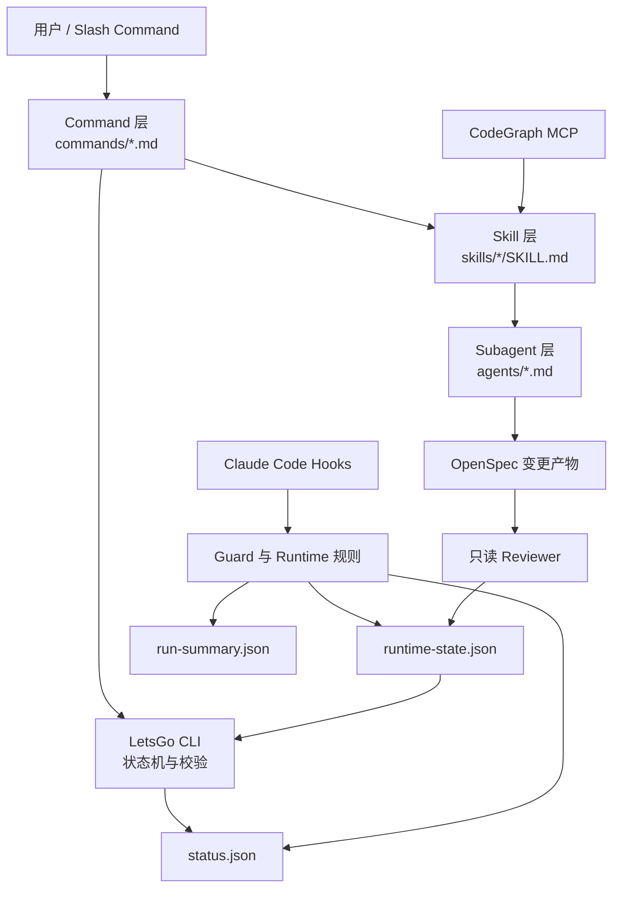
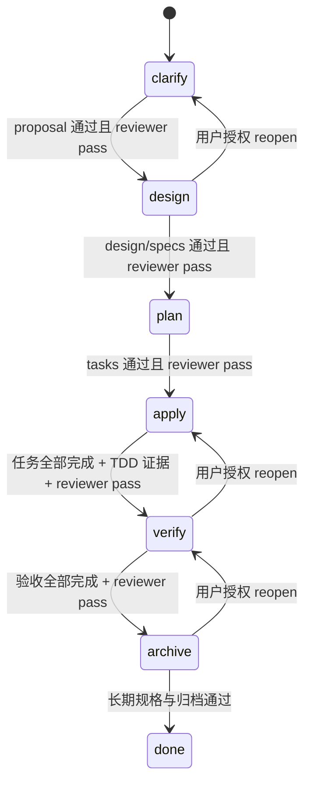

# LetsGo 完整设计说明

本文系统介绍 LetsGo 的设计目标、工作模型、架构、生命周期、命令体系、运行时门禁、
恢复机制和维护方式。它既面向第一次使用 LetsGo 的开发者，也面向需要修改 Hook、Skill、
Subagent 或 CLI 的维护者。

当前文档对应 LetsGo `0.4.31`。

## 1. LetsGo 是什么

LetsGo 是一个面向 Claude Code 的规格驱动开发（Specification-Driven Development，SDD）
插件。它把一次软件变更拆成固定的六个阶段：

```text
clarify -> design -> plan -> apply -> verify -> archive -> done
```

它解决的不是“模型不会写代码”，而是模型在长期、复杂项目中容易出现的工程失控：

- 需求没有澄清就开始修改代码；
- 设计、计划和实现彼此脱节；
- Subagent 被随意命名或派发到错误阶段；
- 测试在实现之后补写，无法证明测试曾捕获缺陷；
- 自动测试通过，但用户可见验收仍未执行；
- reviewer 无限重复启动，持续消耗 token；
- 会话退出、压缩或换模型后，不知道从哪里继续；
- Guard 拒绝后，Agent 改用 Bash、Node 或临时脚本绕过；
- 工作已经完成，却没有形成规格、验证证据和可恢复的 Git 版本。

LetsGo 的核心思路是：把可机械判断的纪律写进状态机和 Hook，把需要判断力的工作交给
专用 Writer、只读 Reviewer 和用户。

## 2. 设计目标与非目标

### 2.1 设计目标

LetsGo 追求以下结果：

1. **阶段明确**：任何时刻都能回答当前变更处于哪个阶段、下一步是什么。
2. **证据可追溯**：需求、设计、任务、TDD、验收和归档都有持久化产物。
3. **角色受约束**：每个阶段只能启动指定 Skill 和指定 Subagent。
4. **实现可验证**：行为修改必须执行真实的 `RED -> GREEN -> REFACTOR`。
5. **中断可恢复**：不依赖模型记忆，而从项目文件和运行状态继续。
6. **权限可解释**：Guard 的放行或拒绝必须能指出当前阶段、目标路径和修复动作。
7. **运行足够轻量**：使用少量覆盖更新的状态文件，不为每次调用生成大量 JSON。
8. **适合大项目**：可使用 CodeGraph 聚焦调用链和影响范围，同时允许安全降级。

### 2.2 非目标

LetsGo 不试图：

- 代替工程师决定产品目标或架构取舍；
- 自动证明所有测试和审查结论绝对正确；
- 允许 Agent 绕过用户权限策略；
- 用一个常驻“监督 Agent”监视所有其他 Agent；
- 把所有工作都压缩成一个万能命令和一个万能 Subagent；
- 自动推送 GitHub 或替用户做不可逆的外部操作。

## 3. 核心工作模型

LetsGo 同时维护三种不同性质的状态。

| 状态 | 事实文件 | 解决的问题 |
| --- | --- | --- |
| 生命周期状态 | `openspec/changes/<change-id>/status.json` | 当前处于哪个阶段，哪些阶段已完成并批准 |
| 当前编排状态 | `openspec/.letsgo/runtime-state.json` | 当前 session 是否加载 Skill，Writer/Reviewer 是否按顺序完成 |
| 轻量运行摘要 | `openspec/.letsgo/run-summary.json` | 阶段历史、权限提示、压缩、Guard 拒绝、CodeGraph 次数等 |

三者不能互相替代：

- `status.json` 是阶段事实来源，不因对话压缩或换模型而改变；
- `runtime-state.json` 是临时控制面，阶段推进后重置；
- `run-summary.json` 用于恢复上下文和观察流程摩擦，不直接授权阶段推进。

普通 Agent 不得手工修改这些控制状态。状态更新由 LetsGo CLI 和 Hook 完成，从而避免
伪造 Skill、Writer 或 Reviewer 已通过。

## 4. 总体架构



### 4.1 Command 层

Command 是用户入口，负责：

- 接收需求或变更 ID；
- 选择变更类型；
- 检查安装、OpenSpec 和 CodeGraph 状态；
- 创建或选择变更；
- 加载正确的工作流 Skill；
- 输出变更位置、工作流、当前状态和下一步。

Command 不应复制全部阶段实现细节。完整生命周期由 `lg:letsgo-workflow` 和阶段 Skill
统一维护，避免多个入口之间规则漂移。

### 4.2 Skill 层

Skill 是阶段编排规范。它规定：

- 当前阶段需要读取哪些输入；
- Writer 和 Reviewer 的启动顺序；
- 哪些校验必须执行；
- 失败、超时、阻塞和复审如何处理；
- 当前阶段允许和禁止做什么。

每个 Skill 使用统一结构：`职责`、`输入`、`执行流程`、`输出`、`边界`。

### 4.3 Subagent 层

Subagent 执行边界明确的具体工作。LetsGo 不允许随意派发 `general-purpose`，必须使用
插件命名空间中的完整名称：

| 阶段 | Writer | Reviewer |
| --- | --- | --- |
| clarify | 主 Agent 完成需求交互 | `lg:letsgo-reviewer` |
| design | `lg:letsgo-design-writer` | `lg:letsgo-reviewer` |
| plan | `lg:letsgo-plan-writer` | `lg:letsgo-reviewer` |
| apply | `lg:letsgo-apply-writer` | `lg:letsgo-reviewer` |
| verify | `lg:letsgo-verify-writer` | `lg:letsgo-reviewer` |
| archive | `lg:letsgo-archive-writer` | `lg:letsgo-reviewer` |

Writer 有当前阶段所需的写权限；Reviewer 只读，不能修改文件、推进状态或替 Writer 修复。
所有专用 Agent 都不能再次调用 Agent/Task，因此只有主 Agent 能控制派发顺序。

### 4.4 CLI 与状态机

CLI 提供确定性的状态操作：创建、选择、校验、推进、继续、恢复和重开。模型可以建议
下一步，但只有 CLI 能改变生命周期状态。

### 4.5 Hook 与 Guard

Hook 把规则接入 Claude Code 生命周期：

- `SessionStart`、`UserPromptSubmit`：注入当前变更和恢复摘要；
- `PreToolUse`：检查写路径、命令类型、Agent 名称和调用顺序；
- `PostToolUse Skill`：记录 Skill 已加载；
- `SubagentStart/Stop`、`PostToolUse Agent|Task`：记录 Agent 运行结果；
- `PermissionRequest/Denied`：统计真实权限提示；
- `PreCompact/PostCompact`：统计上下文压缩；
- `Stop`：生成 token 报告。

Hook 脚本只负责适配宿主输入输出，核心判断放在 `lib/` 中，以便使用 Node 测试验证。

## 5. 六阶段生命周期



### 5.1 Clarify：需求澄清

目标是把模糊请求变成可审查的变更提案。

主要工作：

- 确认为什么做、改变什么、不改变什么；
- 写出可逐条验证的验收标准；
- 识别约束、风险、兼容性和人工决策；
- 对大项目使用 CodeGraph 分析入口、调用链和影响范围；
- 比较必要的候选方案。

主要产物是 `proposal.md`。Clarify 由主 Agent承担，因为需求问题需要直接与用户交互；
有限选项应使用结构化选择工具，自由文本才让用户手工输入。

### 5.2 Design：技术设计

目标是把已批准需求转化为可实现、可测试的方案。

`design.md` 应至少说明：

- 架构和数据流；
- 受影响模块与文件；
- 接口、状态和错误处理；
- 兼容与迁移策略；
- 候选方案及选择理由；
- 风险、回滚和测试策略。

需要表达行为差异时，可在变更目录的 `specs/**` 中建立规格增量。

### 5.3 Plan：任务规划

目标是把设计拆成有依赖顺序的小任务，而不是一条“完成整个功能”的大任务。

`tasks.md` 中每项任务应包含：

- 目标文件或模块；
- 预期行为；
- 测试先行方式；
- 完成条件；
- 必要的依赖关系。

任务使用 Markdown 复选框。Apply 只处理第一个未完成任务，完成并留下证据后再继续下一项。

### 5.4 Apply：实现与 TDD

Apply 是行为变更发生的唯一阶段。每个行为任务固定执行：

1. **RED**：先写最小测试并运行，确认因预期缺失行为失败；
2. **GREEN**：做最小实现，使同一测试通过；
3. **REFACTOR**：整理代码，再次运行测试确认仍通过。

真实命令和结果写入 `tdd-evidence.md`。纯文档、注释、模板、仅测试或明确不改变生产行为
的修改可以豁免，但必须记录具体理由、验证命令和通过结果。

Apply Writer 每次只处理一个未完成任务。若还有任务，返回 `partial`；只有所有任务完成、
`validate --after apply` 通过时才能返回 `ready`。这样即使调用超时或上下文截断，下一次
也能从最后一个完整 Cycle 继续。

### 5.5 Verify：真实验证

Verify 不修改生产代码。它对照 proposal 的每条验收标准执行真实验证，包括适用的：

- 单元测试、集成测试和端到端测试；
- 构建、lint、类型检查和静态检查；
- 浏览器、触屏、键盘和可访问性验收；
- 错误路径、回滚、兼容性和边界条件。

`verification.md` 只有在证据充分、正文没有遗留待验证项，并明确写出
`未验证验收项：0` 时才能标记通过。测试框架缺失不是跳过用户可见验收的理由。

### 5.6 Archive：规格沉淀

Archive 把已验证的行为更新到长期规格 `openspec/specs/**`，并在 `archive.md` 中记录：

- 变更摘要；
- 验证证据；
- 关键设计决策；
- 已知限制和后续工作。

Archive 不修改生产代码。完成后状态进入 `done`，active marker 被清理，默认形成一个
范围明确的本地 Git commit；push 仍需用户明确授权。

## 6. 变更类型

LetsGo 保留多个显式入口，因为不同工作类型的输入契约不同。

| 类型 | 入口 | 关键约束 |
| --- | --- | --- |
| feature | `/lg:start <需求>` | 明确新行为和验收标准 |
| bugfix | `/lg:bugfix <缺陷>` | 先建立复现、预期与实际行为 |
| refactor | `/lg:refactor <目标>` | 明确行为不变量和结构收益 |
| test | `/lg:test <测试需求>` | 默认不改变生产行为 |
| maintenance | CLI 创建后运行 `/lg:letsgo` | 用于工程维护、模板或插件自身改动 |

这些入口最终汇入同一六阶段生命周期，不会各自维护一套不同的 Apply 或 Reviewer 逻辑。

## 7. 命令体系

### 7.1 Slash Commands

| 命令 | 用途 |
| --- | --- |
| `/lg:letsgo <change-id> [类型]` | 连续执行整个生命周期 |
| `/lg:start <需求>` | 创建并开始 feature |
| `/lg:bugfix <缺陷>` | 创建并开始 bugfix |
| `/lg:refactor <目标>` | 创建并开始 refactor |
| `/lg:test <需求>` | 创建并开始 test 变更 |
| `/lg:check <change-id>` | 查看状态和阶段产物 |
| `/lg:structure` | 查看项目结构 |
| `/lg:log <问题>` | 写入 LetsGo 运行问题记录 |
| `/lg:tokens` | 生成 token 和运行指标报告 |
| `/lg:continue [change-id]` | 正常重启、换模型或压缩后的断点续跑 |
| `/lg:recover` | 修复损坏、幽灵或残留状态 |
| `/lg:reopen <change-id> <阶段> <理由>` | 经用户授权后重开阶段 |

`lg` 是插件命名空间。完整命令名可以避免多个插件提供同名命令时加载错误实现。

### 7.2 CLI

```bash
letsgo init [project-dir]
letsgo update [project-dir]
letsgo doctor [project-dir]
letsgo new <change-id> --type feature [project-dir]
letsgo select <change-id> [project-dir]
letsgo status --change <change-id> [project-dir]
letsgo validate --before design --change <change-id> [project-dir]
letsgo validate --after design --change <change-id> [project-dir]
letsgo advance design --change <change-id> [project-dir]
letsgo continue [change-id] [project-dir]
letsgo recover [project-dir]
letsgo reopen apply --change <change-id> --reason "修复验收遗漏" [project-dir]
letsgo tokens [transcript-path] [project-dir]
```

插件把同版本 CLI 放在 `bin/letsgo`，Claude Code 启用插件后会把插件 `bin/` 加入 Bash
PATH。这样 Command、Skill、Hook 和 CLI 一起升级，避免插件已更新但全局 CLI 仍是旧版本。

## 8. 变更目录与产物

典型项目结构如下：

```text
project/
├── CLAUDE.md
├── .claude/
│   ├── commands/
│   ├── skills/
│   └── agents/
├── openspec/
│   ├── change-types/
│   ├── changes/
│   │   └── add-personal-todo/
│   │       ├── status.json
│   │       ├── proposal.md
│   │       ├── design.md
│   │       ├── tasks.md
│   │       ├── tdd-evidence.md
│   │       ├── verification.md
│   │       ├── archive.md
│   │       └── specs/
│   ├── specs/
│   ├── archive/
│   └── .letsgo/
│       ├── active.json
│       ├── runtime-state.json
│       ├── run-summary.json
│       ├── issues.md
│       └── token-report.md
└── .codegraph/
```

`active.json` 只在存在多个活跃变更时帮助选择目标；只有一个活跃变更时 Guard 可以自动
识别。`.codegraph/` 是本机索引，应加入 `.gitignore`。

## 9. Writer、Reviewer 与结果协议

### 9.1 为什么要有机器协议

自然语言中的“完成了”“看起来没问题”无法可靠驱动状态机。每个 Subagent 的最终响应
最后一行必须是 `LETGO_RESULT` JSON，且标记后不能再有文本。

Writer 完成示例：

```text
LETGO_RESULT {"stage":"design","role":"writer","status":"ready","filesChanged":["design.md"],"evidence":["validate --after design 通过"],"risks":[]}
```

Apply 中途检查点：

```text
LETGO_RESULT {"stage":"apply","role":"writer","status":"partial","filesChanged":["src/todo.js","test/todo.test.js"],"evidence":["Cycle 1 完成"],"remainingTasks":["2.1"],"risks":[]}
```

Reviewer 通过示例：

```text
LETGO_RESULT {"stage":"verify","role":"reviewer","status":"pass","blocking":[],"evidence":["验收标准全部有真实证据"],"risks":[]}
```

Reviewer 阻塞示例：

```text
LETGO_RESULT {"stage":"verify","role":"reviewer","status":"blocked","blocking":["触屏验收未执行"],"evidence":["verification.md 仍标记待手测"],"risks":["移动端按钮不可见"]}
```

协议由 `agents/*.md` 统一定义。派发 prompt 只传阶段、change-id、目标文件和审查重点，
不重复粘贴协议，避免不同 Skill 维护出不同字段。

### 9.2 Reviewer 两轮限制

一次初审加一次修订后复审构成一个完整审查周期。第二轮仍阻塞时必须停止，不能启动
第三次 reviewer，也不能把产物手工标记为通过。

若需要继续修订，用户明确授权 `reopen`，开启新的、有审计记录的审查周期。旧结论不会
被删除，而是进入 reopen 历史。

## 10. Guard 权限模型

Guard 只在存在 `openspec/` 的项目中启用。只读工具通常直接放行；写入根据当前阶段、
目标路径和命令风险判断。

| 阶段 | 主要允许写入 |
| --- | --- |
| clarify | 当前变更的 `proposal.md`、`status.json` |
| design | `design.md`、当前变更 `specs/**`、`status.json` |
| plan | `tasks.md`、当前变更 `specs/**`、`status.json` |
| apply | 生产/测试文件、`tasks.md`、`tdd-evidence.md`、`status.json` |
| verify | `verification.md`、`status.json` |
| archive | `archive.md`、长期规格、归档目录、`status.json` |

表中的 `status.json` 指变更目录的生命周期文件，并由 CLI 正常推进。内部的
`openspec/.letsgo/runtime-state.json` 是控制面，不允许 Agent 手工写入。

### 10.1 Bash 与 Node

Guard 自动放行可明确识别的只读命令、测试、语法检查和阶段内项目脚本。以下情况通常
需要审查：

- `node -e`、`node -p` 等可执行任意代码的形式；
- 绝对路径、父目录路径或项目外脚本；
- 管道、普通文件重定向和复合 shell 命令；
- push、历史改写或其他外部副作用。

`2>&1`、`1>&2`、`/dev/null` 和 Windows `NUL` 等安全诊断重定向会被识别，不应误报为
普通文件写入。

### 10.2 相同错误不重试

同一个 Guard 或 Write 错误出现后，应检查一次原因并停止。禁止通过换成 Bash、Node、
临时脚本或另建 maintenance 变更绕过。阻塞问题写入 `openspec/.letsgo/issues.md`。

## 11. CodeGraph 设计

CodeGraph 用于大项目的 Clarify 影响分析。目标不是替代所有读取工具，而是一次聚焦得到：

- 相关源码；
- 调用者和被调用者；
- 数据流和关键依赖；
- 可能受影响的测试；
- 设计需要关注的边界。

每个变更默认一次查询，只有缺少会改变设计结论的关键调用边时才允许第二次。第三次由
Hook 阻止。若 CLI、MCP 或 `.codegraph/codegraph.db` 不可用，明确降级到 Read/Grep，
不阻塞生命周期。

安装与初始化：

```bash
npm install -g @colbymchenry/codegraph
cd <project>
codegraph init
letsgo doctor
```

## 12. 中断、恢复与回退

LetsGo 区分三种动作。

### 12.1 Continue：正常续跑

适用场景：

- 退出或重启 Claude Code；
- 更换模型；
- `/compact` 或自动上下文压缩；
- 网络中断后继续同一变更。

```text
/lg:continue <change-id>
```

Continue 会核对项目根目录、change-id、`status.json` 阶段和 runtime，然后返回唯一的
下一动作：

- `advance`：Reviewer 已通过，可以重新校验并推进；
- `load-skill`：当前 session 需要重新加载阶段 Skill；
- `run-writer`：Writer 尚未完成；
- `run-reviewer`：Writer 已完成但尚未审查；
- `blocked`：两轮审查仍阻塞，等待用户决定。

若 tracking 丢失但阶段产物通过 `validate --after` 硬校验，CLI 可以恢复带
`recoveredFromArtifacts` 的 Writer 检查点；它不会恢复 Skill 或 Reviewer，因此仍需
重新加载 Skill 并复审，不能直接 advance。

### 12.2 Recover：修复损坏状态

Recover 只用于幽灵 runtime、失效 active marker 或状态损坏：

```text
/lg:recover
```

它从 `status.json` 重建运行范围，并返回必须执行的 `/lg:continue <change-id>`。恢复后
不能根据模型口头描述直接派发 Writer。

### 12.3 Reopen：后期发现真实遗漏

如果 Verify 或 Reviewer 发现必须修改已完成的早期阶段：

```text
/lg:reopen <change-id> <target-stage> <理由>
```

Reopen 需要用户明确授权。它撤销目标阶段及后续阶段的批准，保存旧 runtime 和审查快照，
然后从目标阶段重新执行 Skill、Writer、Reviewer 和质量门。

## 13. 可观测性与成本控制

LetsGo 不创建每次调用一个 JSON 的完整事件日志，而使用覆盖更新的单文件摘要。

`run-summary.json` 记录：

- 阶段开始、完成和 reopen；
- Skill 与 Agent 的阶段快照；
- 权限提示次数；
- 澄清问题次数；
- 自动拒绝和重复 Guard 拒绝；
- CodeGraph 调用次数；
- 压缩尝试和完成次数。

`/lg:tokens` 从会话记录生成 `token-report.md`，区分主 Agent 与 Subagent，并按阶段时间窗
计算增量。它用于发现上下文过大、重复审查和过度派发，不作为阶段通过条件。

LetsGo 不设置常驻监督 Subagent。命名、顺序、协议、次数和路径等机械规则由 Hook 检查；
质量判断由一次只读 Reviewer 完成，从而减少额外上下文和“监督监督者”的问题。

## 14. 典型使用流程

### 14.1 新功能

```text
/lg:start 给个人助手增加待办事项，支持创建、完成和按日期筛选
```

入口会检查环境、补齐需求、创建唯一 change-id，随后进入 Clarify。也可以创建后使用：

```text
/lg:letsgo personal-todo feature
```

### 14.2 缺陷修复

```text
/lg:bugfix 清空对话时服务端返回 400；预期清空后保持空会话并可继续发送消息
```

Bugfix 先明确复现、实际行为、预期行为和回归边界，再进入统一生命周期。Apply 中测试应
先复现 400，再实现修复。

### 14.3 重启后继续

```text
/lg:continue personal-todo
```

不要让 Agent 凭记忆说“现在应该是 design/apply”。只执行 Continue JSON 返回的结构化
动作；若 active/status 与 runtime 冲突，先处理冲突，不要点击批准错误 Agent。

### 14.4 Verify 发现遗漏

例如浏览器验收发现触屏按钮不可见：保持 Verify blocked，经用户确认后执行：

```text
/lg:reopen regenerate-reply apply 修复触屏可见性并重新执行浏览器验收
```

不要另建无关 bugfix 掩盖原变更，也不要直接在 Verify 阶段修改生产代码。

## 15. 安装、升级与跨电脑使用

### 15.1 安装插件

```text
/plugin marketplace add <GitHub仓库或本地Marketplace路径>
/plugin install lg@letsgo
```

企业网络策略禁止 GitHub 时，可以先把仓库 clone 到允许的本地路径，再把本地路径添加为
Marketplace。

### 15.2 更新插件

```bash
claude plugin marketplace update letsgo
claude plugin update lg@letsgo
```

更新后应完全退出并重新启动 Claude Code，使 Hook、Command、Skill、Agent 和内置 CLI
一起切换到新版本。若全局安装过旧版 CLI，可卸载它，避免 PATH 优先命中旧命令：

```bash
npm uninstall -g letsgo
```

### 15.3 本地开发加载

```bash
claude --plugin-dir /absolute/path/to/letsgo
```

也可以添加本地 Marketplace 后安装。Windows 上应使用真实 clone 目录，不要把插件目录
和目标项目目录混淆。

## 16. 常见问题排查

| 现象 | 原因 | 正确处理 |
| --- | --- | --- |
| `/lg:continue` 未知 | 插件或 CLI 版本过旧，或更新后未重启 | 更新 Marketplace 与插件，卸载旧全局 CLI，完全重启 |
| Guard 说 apply，但 Agent 说 design | active/status、runtime、项目根目录之一不一致，或 Agent 使用旧记忆 | 不批准；查看冲突信息并显式 `/lg:continue <change-id>` |
| Skill 已加载但 tracking 为空 | 宿主未回传事件、字段不兼容或旧 session runtime 丢失 | 更新插件并运行 `/lg:continue`，不要手改 JSON |
| Writer 已完成但 runtime 丢失 | 上个 session 完成事件未持久化 | Continue 从通过硬校验的产物恢复 Writer，再重载 Skill、复审 |
| Reviewer 已两次阻塞 | 审查周期已达到上限 | 展示 blocking；由用户授权 reopen，不能第三审或手动 pass |
| 写 `proposal.md` 被阻止 | active 变更、阶段或路径解析错误 | 核对 status、active 和完整路径；不要改用 Bash 绕过 |
| Node 命令频繁要求批准 | 命令不可证明只读、使用绝对路径或复合 shell | 优先 Read/Grep；每次 Bash 只执行一个项目内命令 |
| `modelCode` 不存在 | Subagent 模型路由与当前服务不兼容 | 修正 Claude Code/第三方平台模型配置，不属于 proposal 内容问题 |
| CodeGraph 不工作 | CLI 未安装或项目未建索引 | `codegraph init`；失败时允许降级 Read/Grep |
| done 后不能提交 | 旧版 Guard 没有完成态 Git 收尾规则 | 更新插件；只暂存本变更显式路径，不用新 maintenance 绕过 |

## 17. 安全与信任边界

LetsGo 的质量门是分层的：

1. **文件结构校验**：检查阶段产物、必需标题、任务和证据格式；
2. **运行时顺序校验**：检查 Skill、Writer、Reviewer 的顺序和结果；
3. **只读 Reviewer**：检查规格一致性、遗漏、风险和证据可信度；
4. **真实验证**：执行测试、构建和用户可见验收；
5. **用户授权**：控制 reopen、push 和其他外部副作用。

任何一层都不是形式上的装饰。结构校验不能代替 Reviewer，Reviewer 不能代替真实测试，
自动测试不能代替未覆盖的浏览器验收，模型判断也不能代替用户对产品需求的决定。

## 18. 维护和扩展 LetsGo

### 18.1 修改一条规则时要同步哪些位置

根据改动类型，通常需要同时检查：

- 用户入口：`commands/*.md`；
- 阶段编排：`skills/*/SKILL.md`；
- 角色职责：`agents/*.md`；
- 状态与门禁：`state/`、`lib/`、`scripts/`；
- 插件接线：`hooks/hooks.json`、`.claude-plugin/*.json`；
- 项目模板：`templates/`；
- 自动测试：`tests/`；
- 设计理由：`docs/design-decisions.md`；
- 发布信息：`CHANGELOG.md`、`VERSION-ITERATIONS.md` 和版本号。

### 18.2 新增硬门禁的标准

只有满足以下条件才适合写进 Hook：

- 已有真实失败案例；
- 可以低成本、确定性判断；
- 错误信息能给出恢复动作；
- 有 RED 测试证明旧行为失败；
- 有回归测试防止放宽过度；
- 设计决策记录理由、代价和重新评估条件。

架构质量、需求合理性等需要判断力的问题不适合仅靠正则或文件存在性硬编码。

### 18.3 验证插件改动

```bash
npm test
git diff --check
npm_config_cache=/tmp/letsgo-npm-cache npm pack --dry-run
claude plugin validate .
```

发布前还应确认：

- 版本号在 `package.json`、lockfile 和插件 manifest 中一致；
- 插件 tarball 包含 `bin/letsgo`、commands、skills、agents 和 hooks；
- `git status` 中没有无关用户改动；
- 本地 commit 已形成；
- 只有得到用户授权后才执行 push。

## 19. 已知权衡

LetsGo 有意选择了一些工程权衡：

- 六阶段提高可追溯性，但小改动会增加流程成本；
- Reviewer 两轮上限控制 token，但需要 reopen 才能继续新的审查周期；
- 每个 Apply 任务单独派发提高恢复能力，但会增加 Subagent 启动次数；
- CodeGraph 两次预算减少重复上下文，但极复杂调用图可能需要降级工具补充；
- 从产物恢复 Writer tracking 能避免重做，但结构证据不能独立证明历史命令真实性，因此
  必须重新 Reviewer；
- Guard 不能理解所有 shell 语义，无法确定安全时宁可请求批准；
- 第三方模型和 Claude Code 兼容层可能使用不同事件字段，因此需要适配与真实环境回归。

这些限制不是永久不变。调整时应以真实项目数据和失败案例为依据，而不是仅因某次流程
感觉麻烦就删除质量门。

## 20. 一句话总结

LetsGo 把“让 Agent 完成一个需求”变成一条可检查、可恢复、可审查的工程流水线：需求先
澄清，方案先设计，任务先拆小，实现遵循 TDD，验收必须真实完成，结果最终进入长期规格；
模型负责创造和判断，状态机与 Hook 负责守住顺序和证据。

进一步阅读：

- [工作流细节](workflow.md)
- [运行时架构](architecture.md)
- [设计决策与理由](design-decisions.md)
- [版本记录](../CHANGELOG.md)
- [缺陷历史](../BUGS.md)
